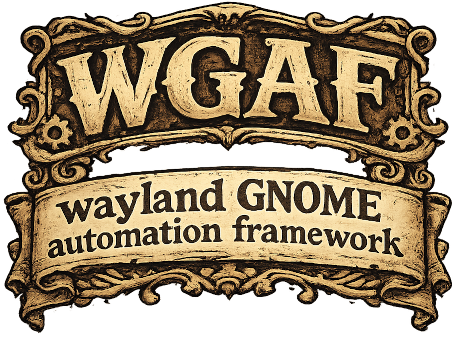

<p align="center">
  
</p>

Script your GNOME desktop from the terminal — move windows, type into apps,
click buttons by name, drive any app's UI. If you relied on `xdotool` or
`wmctrl` before switching to Wayland, this gets that power back, built the
way GNOME actually allows it: no X11 hacks, nothing fighting the compositor,
nothing that stops working with the next GNOME release.

The aim is a desktop that is programmable the way a user operates it — by
window, by button, by name — and predictable enough to trust with the same
task twice. Everything routes through one gated, auditable service, so what
holds for a command you type holds for a script you run and, eventually, for
an AI agent acting on your behalf.

## Why

Wayland's security model correctly stops one app from spying on or
controlling another — which is exactly why `xdotool`/`wmctrl`-style tools
broke, and why most "fixes" for that are workarounds waiting to break again.

wgaf doesn't take that shortcut. Every capability goes through an explicit,
supported interface:

- **GNOME Shell Extension** — window and workspace management
- **Linux `uinput`** — keyboard and mouse synthesis
- **AT-SPI** — the same accessibility system screen readers use, for driving
  application UIs

So it keeps working instead of racing GNOME's next release.

### Compared to the X11 tools

| | `xdotool` | `wmctrl` | wgaf |
|---|---|---|---|
| Works on GNOME Wayland | No | No | **Yes** |
| Works on X11 | Yes | Yes | Not targeted |
| Uses supported GNOME APIs | No | No | **Yes** |
| Window management | Yes | Yes | Yes |
| Keyboard/mouse synthesis | Yes | No | Yes |
| Find UI elements by name/role | No | No | **Yes** |
| JSON output | No | No | **Yes** |
| Per-capability permissions | No | No | **Yes** |

## Roadmap

Checked items work today.

### Window management
- [x] List windows with position, size, workspace, and focus state
- [x] Focus, move, resize, and close windows
- [x] Send a window to another workspace
- [x] Window open, close, and focus events
- [ ] Minimize, maximize, and fullscreen
- [ ] Keep a window always on top, or on every workspace
- [ ] Raise and lower windows
- [ ] More about each window: its process, its type, the dialog it belongs to,
      and the monitor it's on

### Workspaces & monitors
- [x] List workspaces, and switch, add, remove, and reorder them
- [x] See how many workspaces there are, which is active, and how they're
      arranged — including whether GNOME is managing the number for you
- [x] List your monitors, with position, size, rotation, and scale
- [x] The area of each monitor left usable by the top bar and docks

### Keyboard & mouse
- [x] Type text, on whatever keyboard layout your desktop uses
- [x] Press and release individual keys
- [x] Press key combinations like `ctrl shift t`
- [x] Move, click, and scroll the mouse
- [x] Move the pointer to an exact screen position
- [x] Hold off typing when the window you meant isn't focused

### Accessibility
- [x] List running accessible applications
- [x] Read an application's UI tree
- [x] Find elements by name, role, or description
- [x] Click elements and fill text fields
- [ ] Focus an element by name — GTK4 refuses the request, so this does not
      work on GTK applications and cannot be fixed from wgaf's side
- [ ] Read text back out of a widget, to check what was typed
- [ ] Drive sliders, combo boxes, lists, and tables
- [ ] Scroll an off-screen element into view before clicking it
- [ ] Wait for an element to appear, disappear, or change
- [ ] Durable element names, so a script survives the application restarting

### Safety & permissions
- [x] Allow, deny, or prompt per capability
- [x] Caps on how fast and how much synthetic input one command can produce
- [x] Every action that changes something is recorded
- [x] A panic stop for a runaway script — `wgaf stop`, or Escape
- [ ] A readable log file of what wgaf did
- [ ] A panel icon showing when something is automating your desktop
- [ ] Watch what wgaf is doing, live

### Scripting & tooling
- [x] JSON output on every command
- [x] `wgaf status` — what's working and what isn't
- [x] Shell completions and man pages
- [x] systemd user service
- [ ] Launch applications
- [ ] Act on an app by name, without looking up a window id first
- [ ] Run a saved workflow from a file
- [ ] Record what you do, and replay it later
- [ ] Run a script when a window opens, closes, or takes focus
- [ ] Confirm an action had the effect you expected
- [ ] Take a screenshot

### AI agents
- [ ] MCP server, so an agent can drive the desktop under the permissions you set

### Installing & platforms
- [x] GNOME on Wayland
- [ ] `.deb` and `.rpm` packages

## Use cases

- **Scripted window layouts** — snap a specific set of apps into position
  when you start a work session, instead of dragging windows around by hand
  every time.
- **Repetitive UI tasks** — fill out the same form, click through a
  multi-step dialog, or repeat a sequence of clicks and keystrokes without
  doing it by hand each time.
- **Reliable GUI automation** — drive an app by element name instead of
  screen coordinates, so scripts keep working when a window resizes, a theme
  changes, or display scaling differs.
- **Shell-scriptable desktop control** — every command supports `--json`, so
  `wgaf` drops straight into shell scripts, automation frameworks, or an AI
  agent that needs to query and drive the desktop.

See the [user guide](docs/user-guide.md) for how to use each of these, the
[CLI reference](docs/cli-reference.md) for every command's exact flags, and
the [example walkthrough](docs/example-walkthrough.md) for a complete task
done start to finish.

Or watch it work. [`examples/`](examples/) holds scripts you can run that open
real windows and drive them, printing a pass or fail line per step:

```sh
./examples/window-management.sh
```

## How it works

Three separate mechanisms sit behind one CLI — which is why installation has
three parts:

```
                    +---------------+
                    |     wgaf      |
                    |     (CLI)     |
                    +-------+-------+
                            |
                            | D-Bus
                            v
                +-----------------------+
                |      wgaf-daemon      |
                |                       |
                |   permission check    |
                |   audit log           |
                +-----------+-----------+
                            |
        +-------------------+-------------------+
        |                   |                   |
        v                   v                   v
+---------------+   +---------------+   +---------------+
|  GNOME Shell  |   |     Linux     |   |    AT-SPI     |
|   Extension   |   |    uinput     |   | accessibility |
|   (windows)   |   |    (input)    |   |     (UI)      |
+---------------+   +---------------+   +---------------+
```

The GNOME Shell Extension is the only sanctioned way to reach Mutter's window
management, which is why it has to be installed and enabled separately.
`uinput` is a kernel interface, which is why it needs a one-time permissions
step. AT-SPI needs nothing extra — it's on by default on GNOME.

Nothing reaches those three directly. Every command that changes something
passes the daemon's permission check first and is recorded afterwards, which is
what makes [`permissions.toml`](docs/configuration.md#permissionstoml--per-capability-policy)
a real boundary rather than a suggestion — and what keeps it one no matter what
is issuing the commands.

## Get started

You need GNOME Shell on Wayland (tested against GNOME Shell 50), a recent Rust
toolchain, and the `libxkbcommon` development package (`libxkbcommon-dev` on
Debian and Ubuntu, `libxkbcommon-devel` on Fedora).

```sh
git clone https://github.com/Ranrar/wgaf.git
cd wgaf
make install
systemctl --user enable --now wgaf-daemon.service
wgaf ping        # should print: pong
```

Two one-time steps `make install` can't do for you: **log out and back in
once** so GNOME Shell loads the extension, and **grant access to
`/dev/uinput`** so wgaf can synthesize keyboard and mouse input. Both are in
the [installation guide](docs/installation.md#first-time-setup), which also
covers shell completions, man pages, uninstalling, and what to check when
something isn't working.

## Quick examples

Windows are addressed by the numeric id from `wgaf window list` — not by
application name:

```sh
wgaf window list
#    7  ws=0    240,76    800x600   org.gtk.Demo4   Assistant  [focused]

wgaf window focus 7
wgaf window move 7 100 100
wgaf window resize 7 1280 800
wgaf window close 7
```

Type and click:

```sh
wgaf type "Hello from wgaf"
wgaf type "Hello" --window 7   # target a window instead of whatever has focus
wgaf mouse move-to 1500 700
wgaf mouse click left
```

Drive a UI by element name rather than coordinates. Find the element first,
then act on the reference it prints:

```sh
wgaf a11y list-apps
wgaf a11y find --app "Text Editor" --name Save
# button   Save   :1.87#/org/a11y/atspi/accessible/1234

wgaf a11y click ':1.87#/org/a11y/atspi/accessible/1234'
```

Machine-readable output for scripts:

```sh
wgaf window list --json
```

Emergency stop — press **Escape** to stop all input automation immediately,
like pulling a handbrake. It stays stopped until you release it:

```sh
wgaf stop      # same thing, from a terminal
wgaf release   # allow input automation again
```

Escape only belongs to wgaf while automation is actually running. The rest of
the time it is your applications' key as normal — dialogs close, menus dismiss,
and your editor leaves insert mode exactly as they always did.

## Configuration

Two TOML files in `~/.config/wgaf/`, which the daemon finds on its own:

| File | Purpose |
|---|---|
| `config.toml` | Bus name, log level, device name, input safety limits, device settle time |
| `permissions.toml` | What wgaf is allowed to do — `Allow`, `Deny`, or `Prompt` per capability |

`make install` sets both up with the right ownership and mode, and never
overwrites files you already have. Nothing is mandatory beyond the files
existing: an unlisted capability is allowed, so the policy is an opt-in
*restriction* rather than an unlock you must grant before anything works.

```toml
# ~/.config/wgaf/permissions.toml
[capabilities]
TypeText = "Deny"         # block `wgaf type` entirely
CloseWindow = "Prompt"    # ask before closing a window
```

`wgaf status` shows which files are in use and what's restricted. See
[Configuration](docs/configuration.md) for every setting, the full capability
list, and the input safety limits that bound how much synthetic input one
command can produce.

## Known issues

- Typed text and clicks go to whatever has keyboard focus at the moment they
  are sent. `wgaf type` and `wgaf key` can take `--window <id>`, which checks
  that window is focused first — but it is opt-in per command, and clicks have
  no equivalent, so it's still best not to use the desktop while a script is
  running. If one does get away from you, press Escape or run `wgaf stop`.
- The keyboard layout is read once when the daemon starts. If you change your
  layout afterwards, restart the daemon so `wgaf type` picks up the new one:
  `systemctl --user restart wgaf-daemon.service`.
- After `wgaf window move` or `wgaf window resize`, the new position and size
  take a moment to show up in `wgaf window list`. If you're calculating
  coordinates from it, read it again until it reports what you asked for.
- `wgaf ping --json` names its result `response`; every other command uses
  `message`.
- Window and workspace commands need the GNOME Shell extension, and it only
  loads on login — so log out and back in once after installing or updating it.
  `wgaf monitor list` is the exception and works without it, though it can only
  report each monitor's usable area when the extension is there.
- If GNOME is managing your workspaces for you (it does by default), a workspace
  added with `wgaf workspace add` is taken back again as soon as it is left
  empty. `wgaf workspace layout` tells you which mode you are in.

## The goal

A desktop that people, scripts, and AI agents can all operate the same way —
by window, by button, by name — with one service deciding what is allowed and
keeping a record of it, whoever is asking.

The CLI is the first way in. Two more are planned, and both are clients of that
same daemon rather than a second door around it, so the permissions you set
hold for all three:

```
      you            a script          an AI agent
       |                |                   |
       v                v                   v
  +---------+     +-----------+     +----------------+
  |   CLI   |     |  Flow     |     |   MCP server   |
  |  (now)  |     |  Script   |     |   (planned)    |
  |         |     | (planned) |     |                |
  +----+----+     +-----+-----+     +--------+-------+
       |                |                    |
       +----------------+--------------------+
                        |
                        v
              +-----------------------+
              |      wgaf-daemon      |
              |   permission + audit  |
              +-----------+-----------+
                          |
      +-------------+-----+-------+---------------+
      |             |             |               |
      v             v             v               v
   windows        input      accessibility    launching
 (Shell ext.)    (uinput)      (AT-SPI)       (planned)
```

*Flow Script* is a planned plain-text format for describing a task step by
step — launch this, wait for that window, click the button named Save — that
you can read before running it and keep in version control. Shell scripts
around `--json` are today's answer and will keep working.

## Documentation

| | |
|---|---|
| [Installation](docs/installation.md) | Install, first-time setup, completions, uninstall, and what to check when something isn't working |
| [Configuration](docs/configuration.md) | Every setting, the permission policy, and the input safety limits |
| [User guide](docs/user-guide.md) | How to actually use each capability |
| [CLI reference](docs/cli-reference.md) | Every command's exact flags and error messages |
| [Example walkthrough](docs/example-walkthrough.md) | One complete task, start to finish |

## License

MIT — see [LICENSE](LICENSE).
